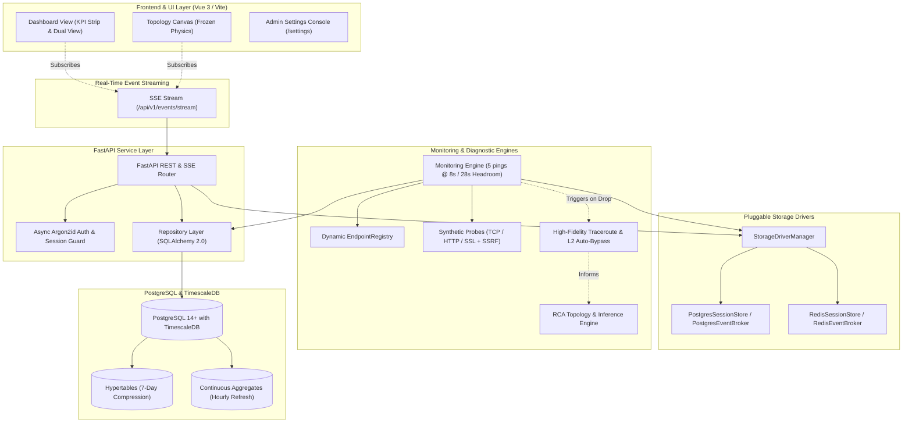
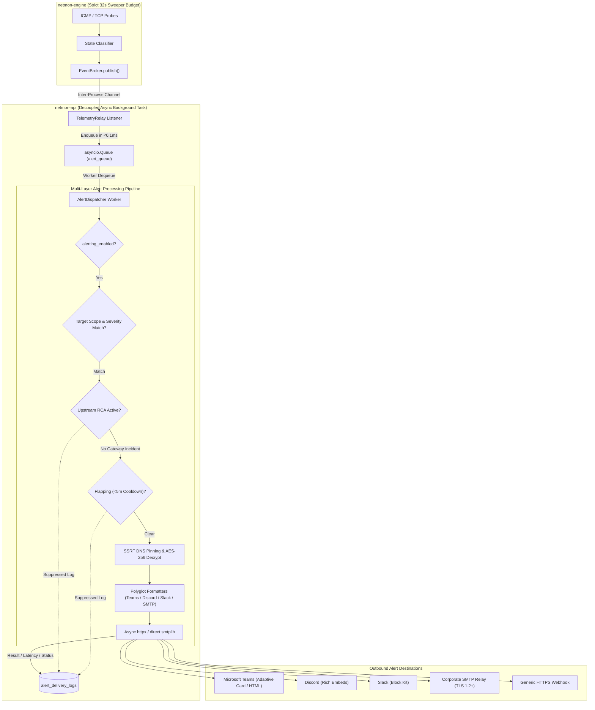

# LNMP Architecture Overview — Version 3.1.0

The Network Monitoring Platform (LNMP) v3.1.0 is architected with a decoupled, asynchronous design engineered for high-concurrency telemetry collection, real-time Server-Sent Events (SSE), dual-driver storage acceleration, enterprise multi-channel notifications, crossing-free topology visualization, and enterprise security governance.

---

## Core System Components

### 1. Data Access & Repository Layer
* **SQLAlchemy 2.0 Async ORM:** All database interactions are mediated by strongly-typed declarative models inheriting from `DeclarativeBase` (`backend/app/models/`).
* **Repository Pattern:** Business logic is decoupled from data persistence through dedicated repositories (`EndpointRepository`, `EventRepository`, `IncidentRepository`, `UserRepository`, `SettingRepository`).
* **SQL-Level Pagination:** All listing endpoints enforce SQL `LIMIT` and `OFFSET` queries, preventing memory bloat on large fleets.
* **Pydantic Settings:** System configuration is centrally validated through typed Pydantic models.

### 2. Concurrency Sweeper & Timing Budget (The Poller)
* **Cycle Timing Budget (5 pings @ 8.0s):** Monitoring probes are tuned to execute 5 pings with an 8.0-second timeout, guaranteeing probe pass completion in ~32 seconds.
* **28-Second Headroom Window:** Leaves 28 seconds of idle headroom before the minute boundary, eliminating thundering herds and connection pool contention.
* **Startup Jitter:** Workers inject 0–2000ms randomized offset at cycle initialization to disperse network bursts.
* **Dynamic In-Memory Registry:** `EndpointRegistry` maintains a thread-safe, concurrent registry allowing sub-minute endpoint additions, updates, and removals with zero engine downtime.

### 3. Dual-Driver Storage Architecture
The platform supports pluggable, dual-driver storage via `StorageDriverManager`:
* **PostgreSQL-Native Driver:**
  - `PostgresSessionStore`: Manages authenticated sessions within the `user_sessions` PostgreSQL table.
  - `PostgresEventBroker`: Uses PostgreSQL `LISTEN / NOTIFY` asynchronous channels to publish and broadcast telemetry events.
* **Redis Acceleration Driver:**
  - `RedisSessionStore`: Caches active sessions in Redis key-value storage with automatic TTL expiry.
  - `RedisEventBroker`: Uses Redis Pub/Sub channels for high-throughput, low-latency inter-process messaging.

### 4. Real-Time Telemetry & Server-Sent Events (SSE)
* **SSE Endpoint (`GET /api/v1/events/stream`):** Delivers continuous telemetry directly to web browsers using `text/event-stream`.
* **Event Envelopes:** Emits structured JSON events on every monitoring transition (`STATE_TRANSITION`, `NODE_STATE_CHANGE`, `RCA_INCIDENT`).
* **Connection Heartbeat:** Emits a 15-second heartbeat comment (`: heartbeat\n\n`) to keep proxy and reverse-proxy connections alive.

### 5. Multi-Protocol Synthetic Monitoring & SSRF Defense
* **Synthetic Probes:**
  - `TCP_PORT`: Validates service port reachability and TCP 3-way handshake latency.
  - `HTTP_STATUS`: Validates HTTP/HTTPS response codes and round-trip time.
  - `SSL_EXPIRY`: Inspects remote TLS certificates and computes days until expiration.
* **SSRF Protection:** `validate_probe_target()` enforces strict IP filtering, blocking loopback (`127.0.0.0/8`, `::1`) and cloud metadata (`169.254.169.254`, `169.254.0.0/16`) targets.

### 6. High-Fidelity Route Diagnostics & RCA Engine
* **High-Fidelity Traceroute:** Uses `traceroute -n -q 2 -w 3 -m 30 -I` with `CAP_NET_RAW` capability for accurate ICMP route tracing and multi-probe latency parsing.
* **Layer-2 Auto-Bypass:** Automatically skips redundant multi-hop traceroutes for devices located on the same direct Layer-2 subnet broadcast domain.
* **Topological RCA (`INFERRED_DOWN`):** When an upstream aggregation node fails, downstream dependent devices are marked `INFERRED_DOWN`, preventing cascading alert storms.

### 7. Interactive Crossing-Free Topology Map
* **4-Phase Sugiyama & Gansner Framework**:
  1. **Phase 1: BFS DAG Longest-Path Layering (`Level(v) = max(Level(u) + 1)`)**: Assigns every node to its exact discrete hop depth tier.
  2. **Phase 2: Crossing Reduction (`edgeMinimization: true`)**: Sugiyama barycenter reordering of sibling nodes to eliminate overlapping diagonal links.
  3. **Phase 3: Coordinate Assignment (`blockShifting: true`, `parentCentralization: true`)**: Gansner coordinate alignment centering parents directly over child clusters.
  4. **Phase 4: Directional Spline Routing (`cubicBezier`)**: Tangent-constrained spline channels with Horizontal (`LR`) ⇄ Vertical (`UD`) switching.
* **Frozen Physics Real-Time Recoloring:** Updates node state colors in place on SSE `NODE_STATE_CHANGE` events with `physics: { enabled: false }` to prevent canvas shaking.

### 8. Enterprise Alerting Subsystem & Decoupling Invariant
* **Decoupling Invariant:** Outbound webhooks and email notifications can experience unpredictable network delays, TLS handshakes, or third-party API rate limits (100ms – 10s+). Running alert dispatching inside the `netmon-engine` monitoring sweep would stall raw ICMP socket reading and blow the critical 32-second sweep budget. To preserve deterministic timing, the **Alert Dispatcher operates entirely within the `netmon-api` service as an independent asynchronous background task pool**.
* **Inter-Process Decoupling Pipeline:**
  1. `netmon-engine` executes ICMP/TCP probes and publishes transitions to `EventBroker` (`LISTEN/NOTIFY` or Redis Pub/Sub) in sub-millisecond time.
  2. `TelemetryRelay` running in `netmon-api` receives the event and enqueues it into an in-memory `asyncio.Queue`.
  3. `AlertDispatcher` pulls from the queue and applies multi-layer filtering:
     - **Scope Filter:** Evaluates target scope (`all` vs. explicit endpoint UUIDs) and severity bitmasks.
     - **RCA Cascade Suppression:** Suppresses individual downstream endpoint notifications when an upstream parent node generates an active `RCA_INCIDENT`.
     - **Flapping Cooldown:** Suppresses alerts if an endpoint exhibits $\ge 3$ state changes within a 10-minute sliding window (max 1 alert per 5 minutes per endpoint/severity).
     - **Cryptographic & SSRF Defense:** Derives AES-256-GCM decryption keys via HKDF-SHA256 and validates outbound destination IPs against loopback and cloud metadata ranges.
     - **Polyglot Formatters:** Adapts payload to Microsoft Teams (Adaptive Cards v1.4 & HTML fallback), Discord (Rich Embeds), Slack (Block Kit), or SMTP TLS 1.2+ MIME.
     - **Delivery Audit Logging:** Persists asynchronous results, HTTP response codes, and round-trip latencies into `alert_delivery_logs`.

---

## Architectural Diagram

---

## Alert Dispatcher Subsystem Diagram

